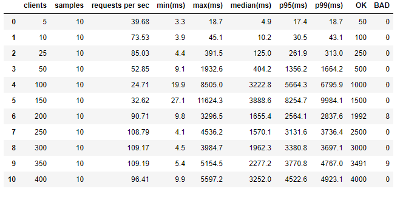
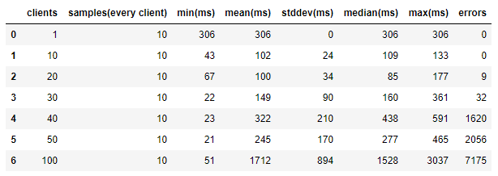

# Load tests report

3 Amazon EC2 instances were used for testing:
* TimeBase instance - t2.xlarge
* Gateway instance - t2.medium
* Client instance - t2.medium

Stream, that tests were preformed for, contained ~7*105 Level 2 market data messages.

## HTTP tests

Tests were performed with [Artillery](https://artillery.io/).

Results were the following:

## Websocket tests

Test wer performed with [Thor](https://github.com/observing/thor).

Results wete the following:

min, mean, sttdev, median and max are about handshake time.